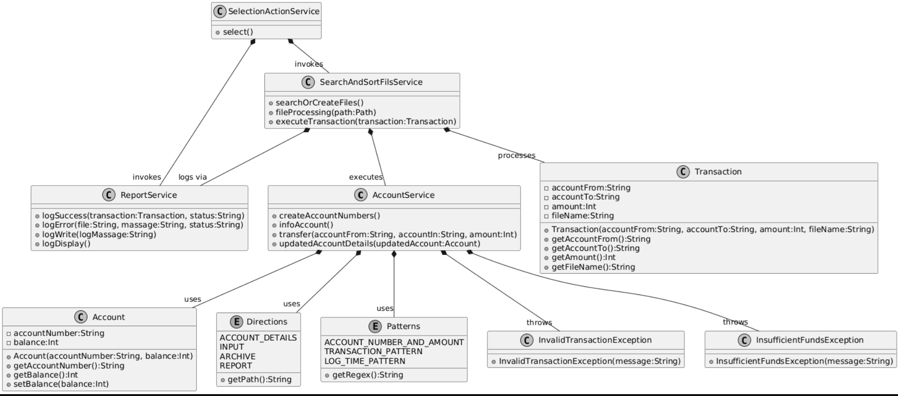

  

DESCRIPTION

The program performs money transfers between accounts, tracks conducted operations, and maintains a history of transactions in a special report file. Users can view transaction logs and repeat the data processing procedure.

INSTALLATION AND LAUNCH

Clone or download the repository and extract it.
Open the project in your preferred IDE (such as IntelliJ IDEA).
If necessary, configure paths to external libraries.
SETTING UP THE ENVIRONMENT

Ensure that the resources folder contains an accountDetails.txt file with account information. The data format should follow the specified regular expression (pattern: account_number(xxxxxxxxxx):balance).Run the launchProgram.java class to open the interactive menu.

FUNCTIONALITY

MAIN CAPABILITIES:

Parsing Data: Parsing files containing account details and executing money transfer operations.
Reporting: Maintaining a transaction journal with viewing capabilities.
User Interaction: Managing processes through an interactive console-based menu.
EXCEPTIONS AND ERRORS:

InsufficientFundsException: Thrown when there are insufficient funds on the account.
InvalidTransactionException: Generated when a transaction fails due to incorrect parameters (e.g., invalid account number).
PROJECT ARCHITECTURE:

model: Contains data models (classes like Account and Transaction).
service: Responsible for transaction handling and reporting services.
exceptions: Handles custom exceptions related to transaction failures.
OPERATING PRINCIPLE:

Data is read from files.
Transactions are executed using the AccountService.
Results of each transaction are saved into a log file.
