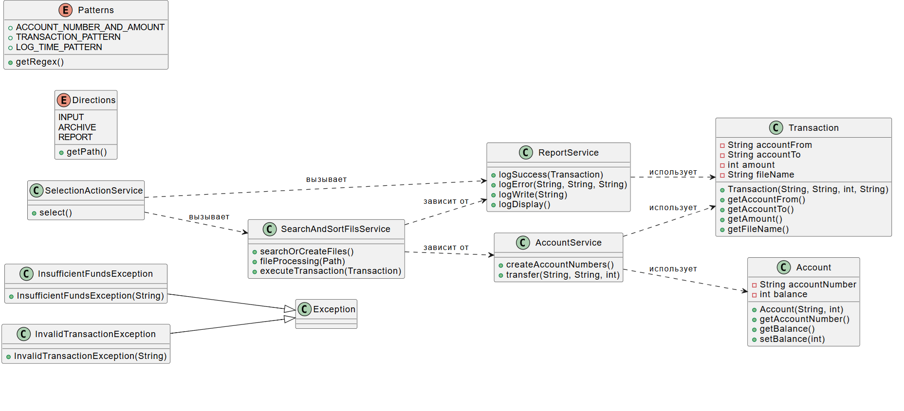

  

ОПИСАНИЕ

Программа для выполнения денежного перевода с одного счета на другой,
ведет учет проведенных операций и сохраняет историю транзакций в специальном файле-отчете. 
Пользователи могут просматривать журналы транзакций и повторять процедуру обработки данных.

УСТАНОВКА И ЗАПУСК:
Импорт проекта, открыть проект в IDEA.
Настроить правильные пути к внешним библиотекам (при наличии).

ПОДГОТОВКА ОКРУЖЕНИЯ:
Убедитесь, что папка resources содержит файл accountDetails.txt с данными счетов.
Данные в файле должны быть организованы согласно описанному регулярному выражению (формат: номер_счета(хххххххххх):баланс).
Запустите класс SelectionActionService.java, чтобы открыть интерактивное меню выбора действий.

ФУНКЦИОНАЛ

ОСНОВНЫЕ ВОЗМОЖНОСТИ:
Парсинг данных: Парсинг файлов с информацией о счетах и проведение операций по переводу средств.
Отчётность: Ведение журнала транзакций с возможностью просмотра отчёта.
Пользовательская активность: Управление процессом с помощью интерактивного меню.

ИСКЛЮЧЕНИЯ И ОШИБКИ:
InsufficientFundsException: Генерируется, если недостаточно средств на счете.
InvalidTransactionException: Генерируется, если транзакция проведена неправильно (например, недопустимый счет).

АРХИТЕКТУРА ПРОЕКТА:
model: Модуль, содержащий модели данных (Account, Transaction).
servise: Сервисный слой, отвечающий за обработку транзакций и ведение отчетности.
exceptions: Исключения, возникающие при обработке транзакций.

ПРИНЦЫП РАБОТЫ:
Данные считываются из файлов.
Транзакции выполняются через сервис AccountService.
Результаты транзакций сохраняются в файл журнала.
